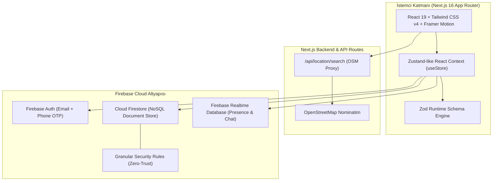

<div align="center">

# 🏘️ Komşu — Mahalle İçi Paylaşım, Dayanışma ve Güvenli İkinci El Platformu

<p align="center">
  <strong>Komşular arası ödünç alma, hediyeleşme, yerel tavsiye ve güvenli alışverişi bir araya getiren yeni nesil hiper-yerel topluluk ağı.</strong>
</p>

[](https://nextjs.org)
[](https://react.dev)
[](https://tailwindcss.com)
[](https://firebase.google.com/)
[](https://www.typescriptlang.org/)
[](https://www.framer.com/motion/)
[](https://zod.dev/)
[](https://opensource.org/licenses/MIT)

<br/>

<a href="#-proje-hakkında">Proje Hakkında</a> •
<a href="#-temel-özellikler">Özellikler</a> •
<a href="#-sistem-mimarisi">Mimari</a> •
<a href="#-teknoloji-yığını">Teknoloji Yığını</a> •
<a href="#-klasör-yapısı">Klasör Yapısı</a> •
<a href="#-kurulum-ve-çalıştırma">Kurulum</a> •
<a href="#-güvenlik-ve-kurallar">Güvenlik</a> •
<a href="#-lisans">Lisans</a>

---

</div>

## 📖 Proje Hakkında

**Komşu**, modern şehir yaşamında kaybolan mahalle dayanışmasını ve sürdürülebilir tüketim kültürünü dijital dünyaya taşıyan açık kaynaklı, hiper-yerel bir paylaşım platformudur.

Platform; kullanıcıların sadece birkaç sokak ötedeki komşularıyla güvenle iletişim kurmasını, evdeki atıl eşyaları ödünç vermesini veya hediye etmesini, mahalle içi duyurular ve tartışmalar başlatmasını ve yerel tavsiyeler almasını sağlar.

---

## ✨ Temel Özellikler

### 🤝 1. Dört Farklı İlan Türü & Kategori Yönetimi
- 🔄 **Ödünç (Borrow):** Matkap, merdiven, kamp sandalyesi veya kitap gibi geçici ihtiyaç duyulan eşyaların komşular arasında paylaşımı.
- 🎁 **Hediye (Gift):** Artık kullanılmayan kıyafet, oyuncak veya mobilyaların çöpe gitmek yerine komşulara ücretsiz bağışlanması.
- 💡 **Tavsiye (Ask):** Güvenilir usta, veteriner, temizlik veya çocuk bakıcısı gibi konularda mahalle içi dayanışma.
- 🏷️ **Satılık (Sell):** Komşular arası kargo ve komisyon masrafı olmadan elden güvenli ikinci el alışverişi.
- 📂 **7 Ana Kategori:** *Alet & Hırdavat, Mutfak & Yemek, Bahçe & Bitki, Kitap & Hobi, Spor & Aktivite, Elektronik, Diğer.*

---

### 📢 2. Mahalle Akışı (Neighborhood Social Feed)
- 📌 Mahalle sakinleri için anlık duyurular, yardım çağrıları ve tartışma panosu.
- ❤️ Gönderi beğenme, yorum yapma ve ilan paylaşma mekanizmaları.
- ⚡ Gerçek zamanlı (Real-time) Firestore senkronizasyonu ile anlık bildirim ve akış güncellemeleri.

---

### 💬 3. Anlık Mesajlaşma (Live Chat Drawer)
- 🚪 İlan detayından doğrudan satıcı/sahip ile özel konuşma başlatabilme.
- ⏱️ Mesaj durumları: *Gönderildi (sent), İletildi (delivered), Okundu (read)*.
- 📍 Konum ve harita koordinatı paylaşabilme desteği.
- 🔔 Realtime Database & Firestore destekli sıfır gecikmeli bildirim altyapısı.

---

### 📍 4. OpenStreetMap & Nominatim Konum Arama
- 🔍 Türkiye il, ilçe ve mahalle bazlı akıllı konum tamamlama (Autocomplete).
- 🛡️ Sunucu taraflı Next.js API Proxy (`/api/location/search`) ve 1 saatlik akıllı önbellekleme (Cache Revalidation).

---

### 🛡️ 5. Komşu Super Control — Yönetim & Moderasyon Paneli (`/komsu-super-control`)
- 📊 **Metrikler:** Kayıtlı komşular, aktif ilanlar, bekleyen şikayetler ve sistem aktivite logları.
- 👥 **Kullanıcı Yönetimi:** Kullanıcı doğrulama (`isVerified`), hesap askıya alma / banlama ve yetki atama.
- 📦 **İlan Denetimi:** Topluluk kurallarına aykırı ilanları yayından kaldırma ve arşivleme.
- 🚨 **Şikayet Merkezi:** Taciz, sahte ilan ve uygunsuz içerik bildirimlerini inceleyip anında aksiyon alma.
- 📢 **Genel Duyuru Sistemi:** Tüm sisteme tek tıkla toplu anons ve bildirim gönderme.

---

### 🌟 6. Güven ve İtibar Sistemi
- ⭐ Komşular arası 5 yıldızlı puanlama ve değerlendirme (Review) sistemi.
- 📱 SMS / Telefon OTP ile doğrulanmış komşu rozeti.
- 🎨 Ad-soyad baş harflerinden üretilen dinamik HSL degrade avatarlar (Sıfır emoji politikası).

---

## 🏗️ Sistem Mimarisi



---

## 🛠️ Teknoloji Yığını

| Katman | Teknoloji / Kütüphane | Kullanım Amacı |
| :--- | :--- | :--- |
| **Framework** | **Next.js 16 (App Router)** | SSR, React Server Actions, Edge Routes & SEO Optimizasyonu |
| **Kullanıcı Arayüzü** | **React 19** | Modern bileşen mimarisi ve State yönetimi |
| **Stil & Tasarım** | **Tailwind CSS v4** | Modern degrade arka planlar, Glassmorphism (`backdrop-blur`) |
| **Animasyon** | **Framer Motion 12** | Spring yumuşak geçişleri, Drawer & Modal mikro etkileşimleri |
| **Veritabanı & Backend**| **Firebase Firestore & RTDB** | Gerçek zamanlı ilan, mesaj, bildirim ve kullanıcı veritabanı |
| **Kimlik Doğrulama** | **Firebase Auth** | E-Posta / Şifre & Telefon SMS OTP Doğrulaması |
| **Form & Validasyon** | **React Hook Form + Zod 4** | Tip güvenli katı girdi doğrulama |
| **İkonografi** | **Lucide React** | Vektörel, minimalist, profesyonel ikon seti |
| **Harita & Konum** | **OpenStreetMap / Nominatim** | Yerel mahalle ve sokak arama altyapısı |

---

## 📂 Klasör Yapısı

```text
komsu/
├── src/
│   ├── app/                               # Next.js App Router sayfaları
│   │   ├── api/location/search/route.ts   # Nominatim OpenStreetMap proxy API
│   │   ├── explore/                       # Keşfet & filtreleme sayfası
│   │   ├── favorites/                     # Favori ilanlar listesi
│   │   ├── feed/                          # Mahalle sosyal akışı
│   │   ├── komsu-super-control/           # Yönetici & Moderasyon Paneli
│   │   │   ├── listings/                  # İlan moderasyonu
│   │   │   ├── reports/                   # Şikayet inceleme merkezi
│   │   │   └── users/                     # Kullanıcı yönetimi & yetkilendirme
│   │   ├── listing/[id]/                  # İlan detay ve teklif sayfası
│   │   ├── profile/                       # Kullanıcı profili & değerlendirmeler
│   │   ├── layout.tsx                     # Kök layout ve GlobalUI sağlayıcıları
│   │   └── page.tsx                       # Ana sayfa (Hero, Filtreler, İlan Grid)
│   │
│   ├── components/                        # Yeniden kullanılabilir UI bileşenleri
│   │   ├── auth/                          # LoginModal, OtpLogin bileşenleri
│   │   ├── chat/                          # ChatDrawer (Anlık sohbet penceresi)
│   │   ├── feed/                          # FeedPostCard, PostCreator bileşenleri
│   │   ├── layout/                        # Header, MobileNav, CategoryFilter, UserCard
│   │   ├── listing/                       # ListingCard, ListingDetailDrawer, NewListingModal
│   │   ├── location/                      # LocationSearch (Autocomplete harita arama)
│   │   └── ui/                            # Toast, Drawer, Modal, Badge, Avatar, StarRating
│   │
│   ├── hooks/                             # Özel React hook'ları (useAuth, useListings)
│   └── lib/                               # Yardımcı kütüphaneler
│       ├── firebase.ts                    # Firebase SDK yapılandırması
│       ├── schemas.ts                     # Zod form ve veri doğrulama şemaları
│       └── store.tsx                      # Global Context Store & Firestore senkronizasyonu
│
├── firestore.rules                        # Zero-Trust Firestore güvenlik kuralları
├── database.rules.json                    # Realtime Database erişim kuralları
├── .cursorrules                           # Geliştirici tasarım & güvenlik manifestosu
└── package.json
```

---

## 🚀 Kurulum ve Çalıştırma

### Gereksinimler
- [Node.js](https://nodejs.org/) (v20.x veya üzeri)
- [npm](https://www.npmjs.com/) veya [pnpm](https://pnpm.io/)
- Firebase Projesi (Firestore, Realtime Database ve Authentication aktif)

---

### 1. Depoyu Klonlayın
```bash
git clone https://github.com/kullaniciadi/komsu.git
cd komsu
```

---

### 2. Bağımlılıkları Yükleyin
```bash
npm install
```

---

### 3. Ortam Değişkenlerini Tanımlayın (`.env.local`)
Kök dizinde `.env.local` dosyası oluşturun ve Firebase proje anahtarlarınızı ekleyin:

```env
NEXT_PUBLIC_FIREBASE_API_KEY="your-api-key"
NEXT_PUBLIC_FIREBASE_AUTH_DOMAIN="your-project-id.firebaseapp.com"
NEXT_PUBLIC_FIREBASE_PROJECT_ID="your-project-id"
NEXT_PUBLIC_FIREBASE_STORAGE_BUCKET="your-project-id.appspot.com"
NEXT_PUBLIC_FIREBASE_MESSAGING_SENDER_ID="your-sender-id"
NEXT_PUBLIC_FIREBASE_APP_ID="your-app-id"
NEXT_PUBLIC_FIREBASE_DATABASE_URL="https://your-project-id-default-rtdb.firebaseio.com"
```

---

### 4. Geliştirme Sunucusunu Başlatın
```bash
npm run dev
```

Tarayıcınızda [http://localhost:3000](http://localhost:3000) adresini açarak uygulamayı test edebilirsiniz.

---

### 5. Firebase Güvenlik Kurallarını Dağıtın (Opsiyonel)
```bash
# Firebase CLI ile kuralları deploy edin
firebase deploy --only firestore:rules,database
```

---

## 🔐 Güvenlik ve Geliştirici İlkeleri

Proje katı **Zero-Trust** ve **Fail-Secure** mimarisine göre geliştirilmiştir:

1. **Katı Firestore Güvenlik Kuralları:** Kullanıcılar sadece kendi ilanlarını ve mesajlarını düzenleyebilir; şikayetler ve loglar doğrudan son kullanıcı erişimine kapalıdır.
2. **Uçtan Uca Zod Doğrulaması:** Tüm form girişleri ve API payload'ları hem istemci hem de servis katmanında tip kontrollü doğrulamadan geçer.
3. **Sıfır Emoji & Premium Görsel Dil:** Arayüzde emoji yerine degrade avatar balonları ve `lucide-react` vektörel simgeleri kullanılır.
4. **Hassas Veri Koruma:** Telefon numaraları ve e-posta adresleri sadece yetkili oturum açmış kullanıcılar arasında işlem bazlı paylaşılır.

---

## 🤝 Katkıda Bulunma

1. Bu depoyu Fork edin (`Fork`)
2. Yeni bir özellik dalı açın (`git checkout -b feature/YeniOzellik`)
3. Değişikliklerinizi commit edin (`git commit -m 'feat: Yeni mahalle rozeti eklendi'`)
4. Dalınıza push yapın (`git push origin feature/YeniOzellik`)
5. Bir **Pull Request** oluşturun

---

## 📄 Lisans

Bu proje **MIT Lisansı** kapsamında lisanslanmıştır.

---

<div align="center">
  Komşuluk bağlarını güçlendirmek amacıyla ❤️ ile geliştirildi.
</div>
